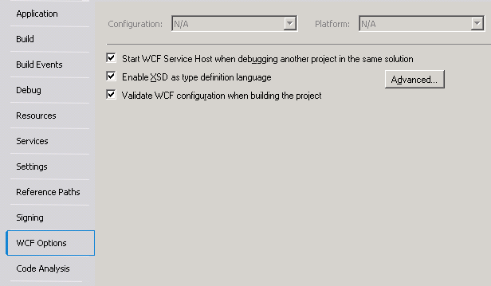
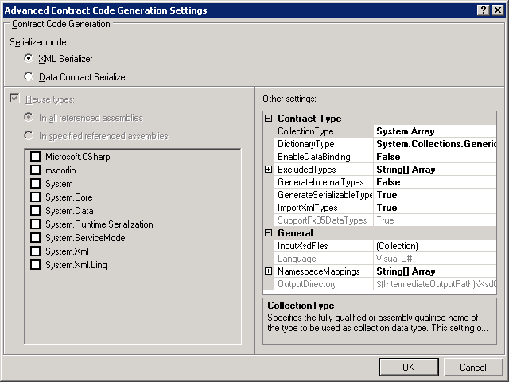

# Contract-First Tool
Service contracts often need to be created from existing services. In [!INCLUDE[net_v45](../../../includes/net-v45-md.md)], data contract classes can be created automatically from existing services using the contract-first tool. To use the contract-first tool, the XML schema definition file (XSD) must be downloaded locally; the tool cannot import remote data contracts via HTTP.  
  
 The contract-first tool is integrated into [!INCLUDE[vs_current_long](../../../includes/vs-current-long-md.md)] as a build task. The code files generated by the build task are created every time the project is built, so that the project can easily adopt changes in the underlying service contract.  
  
 Schema types that the contract-first tool can import include the following:  
  
```  
<xsd:complexType>  
<xsd:simpleType>  
```  
  
 Simple types will not be generated if they are primitives such as `Int16` or `String`; complex types will not be generated if they are of type `Collection`. Types will also not be generated if they are part of another `xsd:complexType`. In all these cases, the types will be referenced to existing types in the project instead.  
  
## Adding a data contract to a project  
 Before the contract-first tool can be used, the service contract (XSD) must be added to the project. For the purposes of this overview, the following contract will be used to illustrate contract-first functions. This service definition is a small subset of the service contract used by Bing’s search API.  
  
```xml  
<?xml version="1.0" encoding="utf-8"?>  
<xs:schema id="ServiceSchema"  
    targetNamespace="http://tempuri.org/ServiceSchema.xsd"  
    elementFormDefault="qualified"  
    xmlns="http://tempuri.org/ServiceSchema.xsd"  
    xmlns:mstns="http://tempuri.org/ServiceSchema.xsd"  
    xmlns:xs="http://www.w3.org/2001/XMLSchema"  
>  
  <xs:complexType name="SearchRequest">  
    <xs:sequence>  
      <xs:element minOccurs="0" maxOccurs="1" name="Version" type="xs:string" default="2.2" />  
      <xs:element minOccurs="0" maxOccurs="1" name="Market" type="xs:string" />  
      <xs:element minOccurs="0" maxOccurs="1" name="UILanguage" type="xs:string" />  
      <xs:element minOccurs="1" maxOccurs="1" name="Query" type="xs:string" />  
      <xs:element minOccurs="1" maxOccurs="1" name="AppId" type="xs:string" />  
      <xs:element minOccurs="0" maxOccurs="1" name="Latitude" type="xs:double" />  
      <xs:element minOccurs="0" maxOccurs="1" name="Longitude" type="xs:double" />  
      <xs:element minOccurs="0" maxOccurs="1" name="Radius" type="xs:double" />  
    </xs:sequence>  
  </xs:complexType>  
  <xs:simpleType name="WebSearchOption">  
    <xs:restriction base="xs:string">  
      <xs:enumeration value="DisableHostCollapsing" />  
      <xs:enumeration value="DisableQueryAlterations" />  
    </xs:restriction>  
  </xs:simpleType>  
</xs:schema>  
  
```  
  
 To add the above service contract to the project, right-click the project and select **Add New…**. Select Schema Definition from the WCF pane of the Templates dialog, and name the new file SampleContract.xsd. Copy and paste the above code into the code view of the new file.  
  
## Configuring contract-first options  
 Contract-first options can be configured in the Properties menu of a [!INCLUDE[indigo2](../../../includes/indigo2-md.md)] project. To enable contract-first development, select the **Enable XSD as Type Definition Language** check box in the WCF page of the project properties window.  
  
   
  
 To configure advanced properties, click the Advanced button.  
  
   
  
 The following advanced settings can be configured for code generation from contracts. Settings can only be configured for all of the files in the project; settings cannot be configured for individual files at this time.  
  
-   **Serializer Mode**: This setting determines which serializer is used for reading service contract files. When **XML Serializer** is selected, the **Collection Types** and **Reuse Types** options are disabled. These options only apply to the **Data Contract Serializer**.  
  
-   **Reuse Types**: This setting specifies which libraries are used for type reuse. This setting only applies if **Serializer Mode** is set to **Data Contract Serializer**.  
  
-   **Collection Type**: This setting specifies the fully-qualified or assembly-qualified type to be used for the collection data type. This setting only applies if **Serializer Mode** is set to **Data Contract Serializer**.  
  
-   **Dictionary Type**: This setting specifies the fully-qualified or assembly-qualified type to be used for the dictionary data type.  
  
-   **EnableDataBinding**: This setting specifies whether to implement the <xref:System.ComponentModel.INotifyPropertyChanged> interface on all data types to implement data binding.  
  
-   **ExcludedTypes**:This setting specifies the list of fully-qualified or assembly-qualified types to be excluded from the referenced assemblies. This setting only applies if **Serializer Mode** is set to **Data Contract Serializer**.  
  
-   **GenerateInternalTypes**: This setting specifies whether to generate classes that are marked as internal. This setting only applies if **Serializer Mode** is set to **Data Contract Serializer**.  
  
-   **GenerateSerializableTypes**: This setting specifies whether to generate classes with the <xref:System.SerializableAttribute> attribute. This setting only applies if **Serializer Mode** is set to **Data Contract Serializer**.  
  
-   **ImportXMLTypes**: This setting specifies whether to configure the data contract serializer to apply the <xref:System.SerializableAttribute> attribute to classes without the <xref:System.Runtime.Serialization.DataContractAttribute> attribute.  This setting only applies if **Serializer Mode** is set to **Data Contract Serializer**.  
  
-   **SupportFx35TypedDataSets**: This setting specifies whether to provide additional functionality for typed data sets created for .Net Framework 3.5. When  **Serializer Mode** is set to **XML Serializer**, the <xref:System.Data.Design.TypedDataSetSchemaImporterExtensionFx35> extension will be added to the XML schema importer when this value is set to True. When  **Serializer Mode** is set to **Data Contract Serializer**, the type <xref:System.DateTimeOffset> will be excluded from the References when this value is set to False, so that <!-- TODO: review code entity reference <xref:DateTimeOffset>  --> is always generated for older framework versions.  
  
-   **InputXsdFiles**: This setting specifies the list of input files. Each file must contain a valid XML schema.  
  
-   **Language**: This setting specifies the language of the generated contract code. The setting must be recognizable by <xref:System.CodeDom.Compiler.CodeDomProvider>.  
  
-   **NamespaceMappings**: This setting specifies the mappings from the XSD Target Namespaces to CLR namespaces. Each mapping should use the following format:  
  
    ```xml  
    “<Schema Namespace>, <CLR Namespace>”  
    ```  
  
     The XML Serializer only accepts one mapping in the following format:  
  
    ```xml  
    “*, <CLR Namespace>”  
    ```  
  
-   **OutputDirectory**: This setting specifies the directory where the code files will be generated.  
  
 The settings will be used to generate service contract types from the service contract files when the project is built.  
  
## Using contract-first development  
 After adding the service contract to the project and confirming the build settings, build the project by pressing **F6**. The types defined in the service contract will then be available for use in the project.  
  
 To use the types defined in the service contract, add a reference to `ContractTypes` under the current namespace:  
  
```csharp  
using MyProjectNamespace.ContractTypes;  
```  
  
 The types defined in the service contract will then be resolvable in the project, as shown below.  
  
   
  
 The types generated by the tool are created in the GeneratedXSDTypes.cs file. The file is created in the \<project directory>/obj/\<build configuration>/XSDGeneratedCode/ directory by default. The sample schema at the beginning of this topic is converted as follows:  
  
```scr  
//------------------------------------------------------------------------------  
// <auto-generated>  
//     This code was generated by a tool.  
//     Runtime Version:4.0.30319.17330  
//  
//     Changes to this file may cause incorrect behavior and will be lost if  
//     the code is regenerated.  
// </auto-generated>  
//------------------------------------------------------------------------------  
  
namespace TestXSD3.ContractTypes  
{  
    using System.Xml.Serialization;  
  
    /// <remarks/>  
    [System.CodeDom.Compiler.GeneratedCodeAttribute("System.Xml", "4.0.30319.17330")]  
    [System.SerializableAttribute()]  
    [System.Diagnostics.DebuggerStepThroughAttribute()]  
    [System.ComponentModel.DesignerCategoryAttribute("code")]  
    [System.Xml.Serialization.XmlTypeAttribute(Namespace="http://tempuri.org/ServiceSchema.xsd")]  
    [System.Xml.Serialization.XmlRootAttribute(Namespace="http://tempuri.org/ServiceSchema.xsd", IsNullable=true)]  
    public partial class SearchRequest  
    {  
  
        private string versionField;  
  
        private string marketField;  
  
        private string uILanguageField;  
  
        private string queryField;  
  
        private string appIdField;  
  
        private double latitudeField;  
  
        private bool latitudeFieldSpecified;  
  
        private double longitudeField;  
  
        private bool longitudeFieldSpecified;  
  
        private double radiusField;  
  
        private bool radiusFieldSpecified;  
  
        public SearchRequest()  
        {  
            this.versionField = "2.2";  
        }  
  
        /// <remarks/>  
        [System.ComponentModel.DefaultValueAttribute("2.2")]  
        public string Version  
        {  
            get  
            {  
                return this.versionField;  
            }  
            set  
            {  
                this.versionField = value;  
            }  
        }  
  
        /// <remarks/>  
        public string Market  
        {  
            get  
            {  
                return this.marketField;  
            }  
            set  
            {  
                this.marketField = value;  
            }  
        }  
  
        /// <remarks/>  
        public string UILanguage  
        {  
            get  
            {  
                return this.uILanguageField;  
            }  
            set  
            {  
                this.uILanguageField = value;  
            }  
        }  
  
        /// <remarks/>  
        public string Query  
        {  
            get  
            {  
                return this.queryField;  
            }  
            set  
            {  
                this.queryField = value;  
            }  
        }  
  
        /// <remarks/>  
        public string AppId  
        {  
            get  
            {  
                return this.appIdField;  
            }  
            set  
            {  
                this.appIdField = value;  
            }  
        }  
  
        /// <remarks/>  
        public double Latitude  
        {  
            get  
            {  
                return this.latitudeField;  
            }  
            set  
            {  
                this.latitudeField = value;  
            }  
        }  
  
        /// <remarks/>  
        [System.Xml.Serialization.XmlIgnoreAttribute()]  
        public bool LatitudeSpecified  
        {  
            get  
            {  
                return this.latitudeFieldSpecified;  
            }  
            set  
            {  
                this.latitudeFieldSpecified = value;  
            }  
        }  
  
        /// <remarks/>  
        public double Longitude  
        {  
            get  
            {  
                return this.longitudeField;  
            }  
            set  
            {  
                this.longitudeField = value;  
            }  
        }  
  
        /// <remarks/>  
        [System.Xml.Serialization.XmlIgnoreAttribute()]  
        public bool LongitudeSpecified  
        {  
            get  
            {  
                return this.longitudeFieldSpecified;  
            }  
            set  
            {  
                this.longitudeFieldSpecified = value;  
            }  
        }  
  
        /// <remarks/>  
        public double Radius  
        {  
            get  
            {  
                return this.radiusField;  
            }  
            set  
            {  
                this.radiusField = value;  
            }  
        }  
  
        /// <remarks/>  
        [System.Xml.Serialization.XmlIgnoreAttribute()]  
        public bool RadiusSpecified  
        {  
            get  
            {  
                return this.radiusFieldSpecified;  
            }  
            set  
            {  
                this.radiusFieldSpecified = value;  
            }  
        }  
    }  
  
    /// <remarks/>  
    [System.CodeDom.Compiler.GeneratedCodeAttribute("System.Xml", "4.0.30319.17330")]  
    [System.SerializableAttribute()]  
    [System.Xml.Serialization.XmlTypeAttribute(Namespace="http://tempuri.org/ServiceSchema.xsd")]  
    [System.Xml.Serialization.XmlRootAttribute(Namespace="http://tempuri.org/ServiceSchema.xsd", IsNullable=false)]  
    public enum WebSearchOption  
    {  
  
        /// <remarks/>  
        DisableHostCollapsing,  
  
        /// <remarks/>  
        DisableQueryAlterations,  
    }  
}  
  
```  
  
## Errors and warnings  
 Errors and warnings encountered in parsing the XSD schema will appear as build errors and warnings.  
  
## Interface Inheritance  
 It is not possible to use interface inheritance with contract-first development; this is consistent with the way interfaces behave in other operations. In order to use an interface that inherits a base interface, use two separate endpoints. The first endpoint uses the inherited contract, and the second endpoint implements the base interface.